# Pi Durable Agent

An independent, open-source agent application built with **Pi Durable**, **OptChat Durable** and **Cloudflare Code Mode**. It keeps conversations and memory in a Durable Object, asks you to approve demo mutations, and retains their outcomes across reconnects.

[Português](./README.pt-BR.md) · [Architecture](./docs/architecture.md) · [Deployment](./docs/deployment.md) · [Roadmap](./docs/roadmap.md) · [Credits](./CREDITS.md)

**Development preview.** The local demo uses the real runtimes and simulated model replies. Only the session-local notes connector is implemented. Cloudflare staging, real model calls, coordinated backup/restore and production qualification remain open. See the [evidence and limits](./docs/validation.md).

## Try it locally

You need **Node.js 22.19+** and npm. You do **not** need Pi installed, a customized Pi distribution, a Cloudflare account or an AI subscription.

```sh
git clone https://github.com/kevinqz/pi-durable-agent.git
cd pi-durable-agent
npm ci
npm run dev
```

Open the local address printed by Wrangler, normally **http://127.0.0.1:8787**.

1. Send a message. The reply explicitly says it is simulated.
2. Use **Find original messages** to retrieve text preserved by OptChat.
3. Select **Try a demo approval**. Review the exact script and pending note in **Approvals**.
4. Approve or reject it. A completed action gets a saved outcome and a follow-up conversation turn.
5. Reload the page. The session URL, conversation, memory and approvals remain addressable. Stop and restart `npm run dev` to reopen the local database.

Local state lives in `.wrangler/` and is ignored by Git. Keep it if you want to retain the demo. Closing a browser does not cancel work; stopping the local server pauses processing until it runs again. A pending approval can outlive the page, but expires after one hour. Simulated replies/summaries demonstrate the plumbing; they do not measure AI quality or prompt-cache savings.

## Already using Pi?

Choose what you need:

| Need                                                                        | Install                                                                     |
| --------------------------------------------------------------------------- | --------------------------------------------------------------------------- |
| OptChat memory in your existing Pi coding agent                             | `pi install https://github.com/kevinqz/optchat-durable@v0.4.0`              |
| OptChat memory in your own Pi Durable host                                  | The [OptChat public SDK](https://github.com/kevinqz/optchat-durable#readme) |
| A separate web app with Cloudflare lifecycle and approved Code Mode actions | This repository, with `npm ci` and `npm run dev`                            |

This application does not replace your Pi installation or import your local OAuth credentials. A ChatGPT/Claude login in Pi does not configure a hosted Cloudflare model. The optional hosted model path uses the official Workers AI binding, configured separately in the [deployment guide](./docs/deployment.md).

## What runs where

```mermaid
flowchart LR
  Browser --> Access[Access authentication / local demo]
  Access --> Session[Session Durable Object]
  Session --> Lifecycle[Cloudflare Lifecycle + PiHarness]
  Lifecycle --> Pi[Pi Durable + supplied SQLite storage]
  Pi --> Memory[Published OptChat memory extension]
  Pi --> Receipt[Durable action receipt]
  Receipt --> CodeMode[Official Code Mode runtime + sandbox]
  CodeMode --> Approval[Exact operation approval]
  Approval --> Notes[Session-local notes with deduplication]
  Notes --> Outbox[Retained result + delivery record]
  Outbox --> Memory
```



Each authenticated identity and session name maps to a separate Durable Object. All conversational input, including completed-action follow-ups, goes through OptChat's controller. The application uses its published **0.4.0** package; it does not fork the memory engine or patch Pi/Cloudflare internals.

Code Mode 0.5.3 does not expose an execute-or-attach idempotency key. This app records admission before dispatch, uses one named runtime per action, and never silently starts another execution after an ambiguous dispatch. **Unknown** means inspection or operator reconciliation is required. This is not an exactly-once guarantee for arbitrary external services.

## Develop

```sh
npm run typecheck
npm test
npm run build
```

The focused tests run locally in Cloudflare's Workers runtime with synthetic models and a local connector. `build` is a dry run and does not deploy. `npm run check` also checks formatting. CI repeats those same checks; local development does not depend on GitHub being available after installation.

| Directory                                     | Responsibility                                                        |
| --------------------------------------------- | --------------------------------------------------------------------- |
| `src/worker.ts`, `src/auth.ts`, `src/http.ts` | Authenticated HTTP boundary, request limits and routing               |
| `src/session.ts`, `src/store.ts`              | Native Pi/OptChat composition, durable admission and session metadata |
| `src/actions.ts`, `src/actions-store.ts`      | Action identity, runtime reconciliation, archives and result delivery |
| `src/notes.ts`, `src/tools.ts`                | Versioned demo connector and native Pi extension                      |
| `src/models.ts`                               | Explicit model configuration and credential-free simulation           |
| `public/`                                     | Small browser interface; no frontend framework or build step          |
| `test/`                                       | Focused runtime and authorization checks                              |
| `docs/`                                       | Architecture, deployment, limits, evidence and roadmap                |

Dependency versions and artifact integrity are fixed by `package-lock.json`. Cloudflare's Pi adapter is beta; upgrades are reviewed explicitly. [Contributing](./CONTRIBUTING.md) explains the change policy.

## Credits

**Victor Taelin** designed OptChat/UniiChat's hierarchical conversation memory. **Mario Zechner, Earendil Works and the Pi contributors** built Pi Durable, Pi AI and Chord. **Cloudflare and its contributors** built Agents, PiHarness, Lifecycle, Code Mode and the Workers tooling. **Kevin Saltarelli** maintains OptChat Durable and this independent application.

See [credits and source references](./CREDITS.md), [third-party notices](./THIRD_PARTY_NOTICES.md) and [citation metadata](./CITATION.cff). This project is not an official Pi or Cloudflare product and implies no upstream endorsement. Original application code is [MIT licensed](./LICENSE); dependencies retain their own licenses.
