# Pi Durable Agent

An independent, open-source agent application built with **Pi Durable**, **OptChat Durable** and **Cloudflare Code Mode**. It keeps conversations and memory in a Durable Object, asks you to approve demo mutations, and retains their outcomes across reconnects.

[Português](./README.pt-BR.md) · [Architecture](./docs/architecture.md) · [Deployment](./docs/deployment.md) · [Roadmap](./docs/roadmap.md) · [Credits](./CREDITS.md)

**Development preview.** The demo uses real runtimes and simulated model replies; only the session notes connector is implemented. New sessions have [checkpoint and restore controls](./docs/coordinated-recovery.md), verified locally and in a protected hosted demo flow. A complete stopped local installation also has an [offline backup workflow](./docs/local-recovery.md). Bounded hosted interruption checks also passed in a private fixture. Real model calls, a second authenticated identity and the operational release remain pending. See the [evidence and limits](./docs/validation.md).

## Try it locally

You need **Node.js 22.19+** and npm. You do **not** need Pi installed, a customized Pi distribution, a Cloudflare account or an AI subscription.

```sh
git clone https://github.com/kevinqz/pi-durable-agent.git
cd pi-durable-agent
npm ci
npm run dev
```

Open the local address printed by Wrangler, normally **http://127.0.0.1:8787**.

1. Send a message. The reply explicitly says it is simulated.
2. Use **Find original messages** to retrieve text preserved by OptChat.
3. Select **Try a demo approval**. Review the exact script and pending note in **Approvals**.
4. Approve or reject it. A completed action gets a saved outcome and a follow-up conversation turn.
5. Reload the page. The session URL, conversation, memory and approvals remain addressable. Stop and restart `npm run dev` to reopen the local database.
6. Select **Export session data** to download the retained history, current memory and action records as JSON. The [offline verifier](./docs/session-export.md) checks file integrity. This readable export cannot restore a running session.
7. After active work finishes, select **Create checkpoint** under **Session recovery**. Wait for **Checkpoint saved**. Continue the conversation, then use **Restore…** and review the confirmation to return to that saved state. Notes already created and recorded model usage remain retained. [Recovery instructions and scope](./docs/coordinated-recovery.md).

New session URLs start with `#c1:`. Older URLs keep opening the original session; use **New session** to try checkpoints. A checkpoint restores the conversation within the same Durable Object. It does not protect against deleting that object or losing the account.

Local state lives in `.wrangler/` and is ignored by Git. Keep it if you want to retain the demo. Closing a browser does not cancel work; stopping the local server pauses processing until it runs again. A pending approval can outlive the page, but expires after one hour. Simulated replies/summaries demonstrate the plumbing; they do not measure AI quality or prompt-cache savings.

To keep a recoverable local copy, stop the server and run:

```sh
npm run state -- backup --to .local-backups/demo
npm run state -- restore .local-backups/demo --to .local-restores/demo
npm run dev -- --persist-to .local-restores/demo
```

Open the same session URL. This preserves the complete local runtime state and restores into a new directory; it does not overwrite the original. Backup/restore requires `lsof` on macOS/Linux. See [verification, compatibility and interrupted-operation recovery](./docs/local-recovery.md).

**Updating an existing installation?** Keep the old checkout and follow the [local upgrade guide](./docs/local-upgrades.md). The reviewed **0.1.0-dev.4 → 0.1.0-dev.5** route opens a separate copy and retains memory, completed actions and pending approvals. Earlier installations follow the retained routes sequentially: dev.0 → dev.1 → dev.2 → dev.3 → dev.4 → dev.5.

**Want it hosted?** Local development requires no account or payment. The complete hosted app needs **Cloudflare Workers Paid** for Dynamic Workers/Code Mode, starting at US$5 per account/month plus excess usage. Use your existing account; a custom domain is optional. Model inference is separate. Follow the [private staging walkthrough](./docs/staging.md) and [deployment and cost guide](./docs/deployment.md) when ready.

## Already using Pi?

Choose what you need:

| Need                                                                        | Install                                                                     |
| --------------------------------------------------------------------------- | --------------------------------------------------------------------------- |
| OptChat memory in your existing Pi coding agent                             | `pi install https://github.com/kevinqz/optchat-durable@v0.4.0`              |
| OptChat memory in your own Pi Durable host                                  | The [OptChat public SDK](https://github.com/kevinqz/optchat-durable#readme) |
| A separate web app with Cloudflare lifecycle and approved Code Mode actions | This repository, with `npm ci` and `npm run dev`                            |

This application does not replace your Pi installation or import your local OAuth credentials. A ChatGPT/Claude login in Pi does not configure a hosted Cloudflare model. The optional hosted model path uses the official Workers AI binding, configured separately in the [deployment guide](./docs/deployment.md).

**Use a real model:** once Workers AI is configured, choose it under **Model for the next session** and select **New session**. Existing demo conversations remain addressable. Each new conversation retains its selected model and a visible call allowance, including memory summaries and failed attempts. See [model setup and consumption limits](./docs/models.md).

## What runs where

```mermaid
flowchart LR
  Browser --> Access[Access authentication / local demo]
  Access --> Root[Session supervisor: owner, effects, usage, recovery]
  Root --> Session[Active session facet]
  Root --> Checkpoint[Inactive subtree checkpoint]
  Session --> Lifecycle[Root alarm bridge + PiHarness]
  Lifecycle --> Pi[Pi Durable + supplied SQLite storage]
  Pi --> Memory[Published OptChat memory extension]
  Pi --> Receipt[Durable action receipt]
  Receipt --> CodeMode[Official Code Mode runtime + sandbox]
  CodeMode --> Approval[Exact operation approval]
  Approval --> Notes[Root-owned notes with deduplication]
  Notes --> Outbox[Retained result + delivery record]
  Outbox --> Memory
```



Each authenticated identity and session name maps to a separate Durable Object. New sessions keep their conversation and nested Code Mode runtimes in a facet subtree, with consumption and destination records outside the restorable copy. Existing sessions retain their original namespace and connector contract. All conversational input, including completed-action follow-ups, goes through OptChat's controller. The application uses its published **0.4.0** package; it does not fork the memory engine or patch Pi/Cloudflare internals.

Code Mode 0.5.3 does not expose an execute-or-attach idempotency key. This app records admission before dispatch, uses one named runtime per action, and never silently starts another execution after an ambiguous dispatch. **Unknown** means inspection or operator reconciliation is required. This is not an exactly-once guarantee for arbitrary external services.

## Develop

```sh
npm run typecheck
npm test
npm run test:checkpoints
npm run build
```

The focused tests run locally in Cloudflare's Workers runtime with synthetic models and a local connector. `build` is a dry run and does not deploy. `npm run check` also checks formatting. CI repeats those same checks; local development does not depend on GitHub being available after installation.

`test:checkpoints` exercises native subtree restoration, destination deduplication, generation fencing and separation of the legacy/new HTTP routes. It runs an isolated fixture of the application composition. `npm run runtime:update` refreshes the reviewed backend identity after source changes; `npm run check` refuses a stale identity. Separate [hosted evidence](./docs/coordinated-recovery.md#hosted-evidence-and-remaining-work) covers a protected demo restore and three native root-abort boundaries. Real inference, a second authenticated identity and the operational release remain pending.

| Directory                                                                              | Responsibility                                                                     |
| -------------------------------------------------------------------------------------- | ---------------------------------------------------------------------------------- |
| `src/worker.ts`, `src/auth.ts`, `src/http.ts`                                          | Authenticated HTTP boundary, request limits and routing                            |
| `src/session.ts`, `src/store.ts`                                                       | Native Pi/OptChat composition, durable admission and session metadata              |
| `src/actions.ts`, `src/actions-store.ts`, `src/action-contracts.ts`                    | Action identity, retained contracts, reconciliation, archives and result delivery  |
| `src/notes.ts`, `src/notes-root.ts`, `src/tools.ts`                                    | Versioned demo connector and native Pi extension                                   |
| `src/recovery.ts`                                                                      | Owner-authorized demo reset, activation identity and bounded restart receipts      |
| `src/session-supervisor.ts`, `src/checkpoint-coordinator.ts`, `src/facet-lifecycle.ts` | Session recovery composition, generation journal and root-alarm bridge             |
| `src/session-export.ts`                                                                | Bounded session data archive with public history pagination and integrity checks   |
| `src/models.ts`, `src/session-model.ts`                                                | Model adapters, immutable session selection, durable call allowance and simulation |
| `public/`                                                                              | Small browser interface; no frontend framework or build step                       |
| `test/`                                                                                | Focused runtime and authorization checks                                           |
| `scripts/`                                                                             | Guarded local startup, offline snapshots and recovery qualification                |
| `compatibility/`                                                                       | Exact reviewed source/target release identities for local updates                  |
| `docs/`                                                                                | Architecture, deployment, limits, evidence and roadmap                             |

Dependency versions and artifact integrity are fixed by `package-lock.json`. Cloudflare's Pi adapter is beta; upgrades are reviewed explicitly. [Contributing](./CONTRIBUTING.md) explains the change policy.

## Credits

**Victor Taelin** designed OptChat/UniiChat's hierarchical conversation memory. **Mario Zechner, Earendil Works and the Pi contributors** built Pi Durable, Pi AI and Chord. **Cloudflare and its contributors** built Agents, PiHarness, Lifecycle, Code Mode and the Workers tooling. **Kevin Saltarelli** maintains OptChat Durable and this independent application.

See [credits and source references](./CREDITS.md), [third-party notices](./THIRD_PARTY_NOTICES.md) and [citation metadata](./CITATION.cff). This project is not an official Pi or Cloudflare product and implies no upstream endorsement. Original application code is [MIT licensed](./LICENSE); dependencies retain their own licenses.
